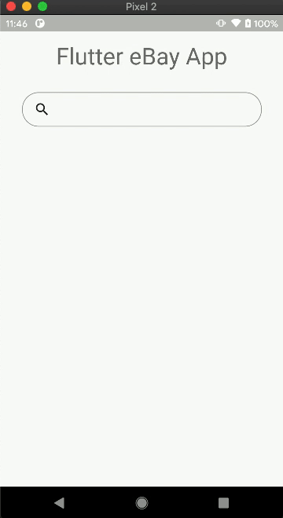

# flutter_triple_ecommerce

Simple Flutter e-commerce mobile application that uses [Triple](https://triple.flutterando.com.br) (or Segmented State Pattern) for its state management.

## Screenshots

| Search products |
| - |
|  |

## Features

- [x] Searches products by a keyword from [eBay Sandbox API](https://developer.ebay.com/api-docs/buy/browse/static/overview.html) (uses [Executor](https://triple.flutterando.com.br/docs/getting-started/executors)).
- [x] Handles state, loading, and error with [`ScopedBuilder`](https://triple.flutterando.com.br/docs/getting-started/using-flutter-triple#scopedbuilder).
- [x] Undo search via [MementoMixin](https://triple.flutterando.com.br/docs/getting-started/Mixins#mementomixin).
- [x] Tracks errors with [TripleObserver](https://triple.flutterando.com.br/docs/getting-started/tracking)
- [x] Overrides [middleware](https://triple.flutterando.com.br/docs/getting-started/middleware) for sorting products by its price.
- [x] Persists last search result in shared preferences with [HydratedMixin](https://triple.flutterando.com.br/docs/getting-started/Mixins#hydratedmixin).
- [ ] Triple Testing
- [x] Code documentation

## Packages

- [`flutter_triple: ^1.2.6`](https://pub.dev/packages/flutter_triple): For Triple (Segmented State Pattern).
- [`equatable: ^2.0.3`](https://pub.dev/packages/equatable): For overriding `==` operation of models.
- [`http: ^0.13.4`](https://pub.dev/packages/http): For making HTTP requests.
- [`hydrated_triple: ^0.0.3`](https://pub.dev/packages/hydrated_triple): For HydratedMixin (persisting state in shared preferences).
- [`triple_test: ^0.0.8`](https://pub.dev/packages/triple_test): Store testing.

